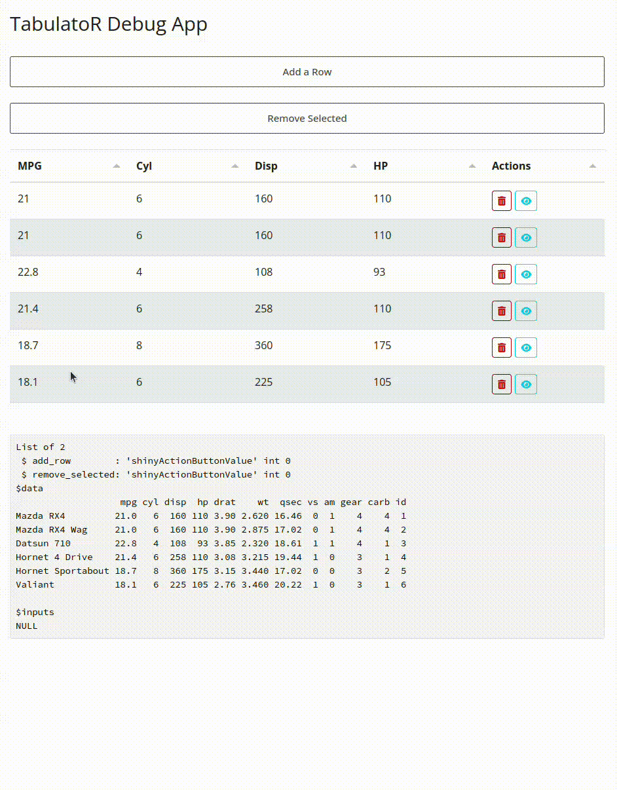

# tabulatoR

tabulatoR is an R wrapper around the [tabulator](https://tabulator.info/) javascript library that makes interactive table generation easy within R applications like the Shiny framework.

The motivation behind tabulatoR was a suitable library for CRUD operations. While there  is no shortage of suitable and common ways to display interactive tables in R and Shiny the extension to things like adding or removing rows often feels second-hand. The tabulatoR package was made specifically with editing in mind. 



## Quick Start

```r
# remotes::install_github("kent-orr/tabulatoR")
# Click a cell to edit it. Changes are available on the server through standard Shiny inputs named after the tabulator output.
library(shiny)
library(bslib) # bslib is nott required, but it sure does make things pretty
library(tabulatoR)

ui <- page_fillable(
  tabulatoROutput("table"),
  verbatimTextOutput("edits")
)

server <- function(input, output, session) {
    output$table <- renderTabulatoR(head(cars), editable=TRUE)
    output$edits <- renderPrint(str(input$table))
}

shinyApp(ui, server)
```


## What you get out of the box

- Editable cells
- Sorting and filtering
- Large table performance
- Works inside standard Shiny reactivity

## Low barrier, high ceiling

Start simple with defaults. When you need more, tabulatoR gives you direct access to the full Tabulator API—no fighting the wrapper. Pass custom column definitions, add JavaScript formatters, or hook into any Tabulator feature without leaving R.


```r
library(shiny)
library(bslib)
library(tabulatoR)

ui <- page_fillable(
  tags$head(
    tags$link(rel = "stylesheet",
              href = "https://cdnjs.cloudflare.com/ajax/libs/font-awesome/6.4.0/css/all.min.css")
  ),
  tabulatoROutput("table")
)

server <- function(input, output, session) {
  output$table <- renderTabulatoR(
    head(mtcars),
    columns = c(
      Column('MPG', 'mpg'),
      Column('Cyl', 'cyl'),
      Column('Actions', field = NULL, formatter = js(
        r'(
        (cell) => {
          const row = cell.getRow();
          const el = cell.getElement();
          const div = document.createElement('div');
          div.style.display = "flex";
          div.style.gap = "5px";

          // Delete button
          const deleteButton = document.createElement('button');
          deleteButton.className = "btn btn-sm btn-outline-danger";
          const deleteIcon = document.createElement('i');
          deleteIcon.className = "fas fa-trash-alt";
          deleteButton.appendChild(deleteIcon);
          deleteButton.onclick = () => row.delete();
          div.appendChild(deleteButton);

          // View button
          const viewButton = document.createElement('button');
          viewButton.className = "btn btn-sm btn-outline-info";
          const viewIcon = document.createElement('i');
          viewIcon.className = "fas fa-eye";
          viewButton.appendChild(viewIcon);
          viewButton.onclick = () => {
            Shiny.setInputValue("view_row", row.getData(), {priority: 'event'});
          };
          div.appendChild(viewButton);

          el.appendChild(div);
          return div;
        }
        )'
      ))
    )
  )

  observeEvent(input$view_row, {
    showNotification(paste("Viewing row with MPG:", input$view_row$mpg), type = "message")
  })
}

shinyApp(ui, server)
```